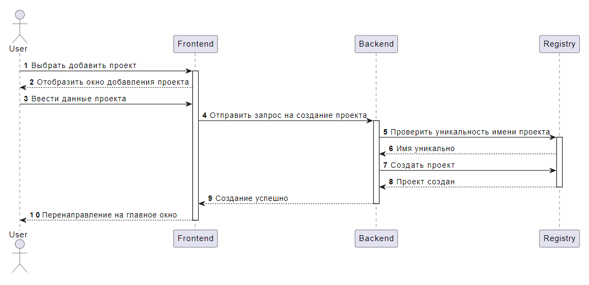
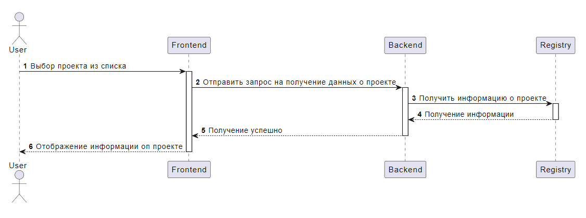
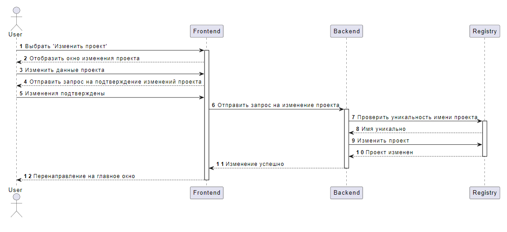
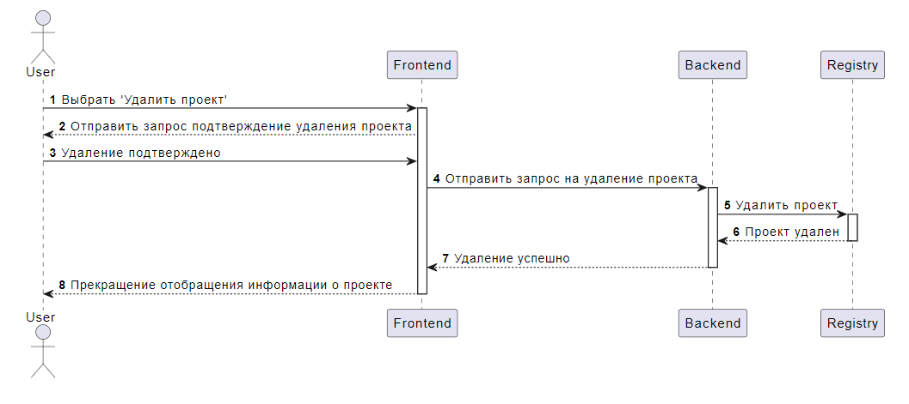
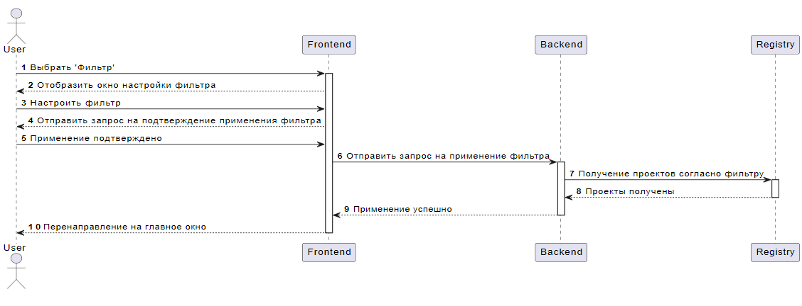

# Диаграммы последовательности
---

# Содержание
1. [Добавление проекта](#1)
2. [Просмотр проекта](#2)
3. [Изменение информации о проекте](#3)
4. [Удаление проекта](#4)
5. [Фильтрация проектов](#5)

### 1. Добавление проекта

### 2. Просмотр проекта

### 3. Изменение информации о проекте

### 4. Удаление проекта

### 5. Фильтрация проектов

