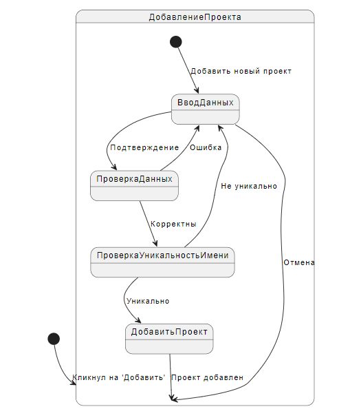
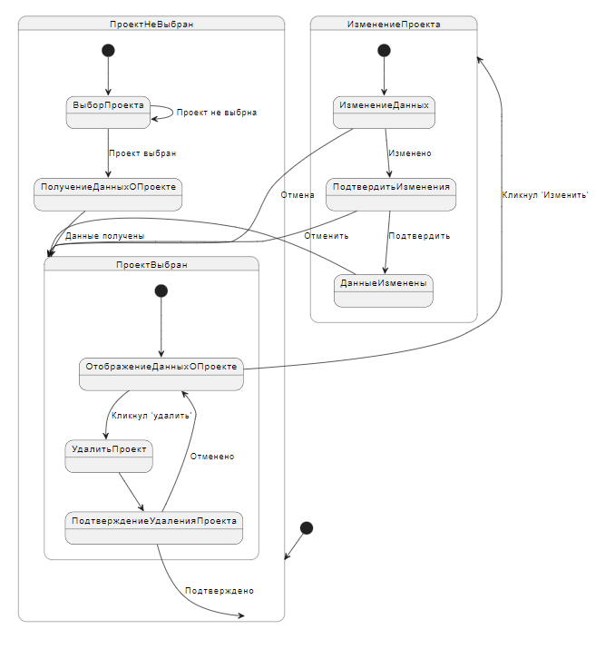
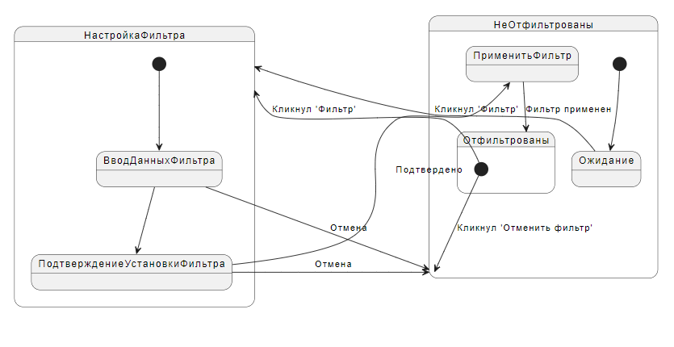

# Диаграммы состояний
---

# Содержание
1. [Добавление проекта](#1)
2. [Просмотр проекта, изменение информации и удаление](#2)
3. [Фильтрация проектов](#3)

### 1. Добавление проекта

### 2. Просмотр проекта, изменение информации и удаление

### 3. Фильтрация проектов

