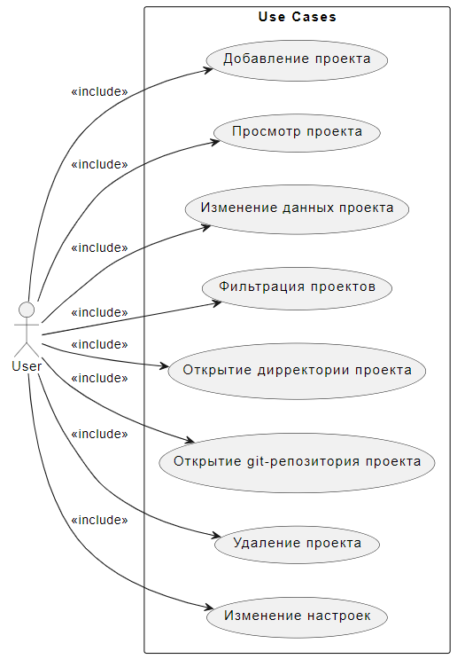

# Диаграмма вариантов использования

---

## Варианты использования

---

## 2.1 Добавить проект

**Описание:** Вариант использования "Добавить проект" позволяет пользователю добавить новый проект в приложение Projects-Manager.

**Предусловия:** Нет.

**Основной поток:**
1. Пользователь выбирает опцию добавления нового проекта в главном окне приложения Projects-Manager.
2. Система отображает форму добавления нового проекта.
3. Пользователь вводит информацию о проекте в окне добавления нового проекта приложения Projects-Manager.
4. Система проверяет правильность введённых данных (ввод всех обязательных полей).
5. Если данные верны, система проверяет уникальность имени проетка.
6. Если имя уникально, система сохраняет данные проекта в реестр.
7. Система отображает главное окно приложения Projects-Manager.

## 2.2 Просмотр проекта 

**Описание:** Вариант использования "Просмотр проекта" позволяет пользователю выбрать проекта для просмотра его информации в приложении Projects-Manager.

**Предусловия:** Пользователь ранее добавил хотя бы один проект в приложение Projects-Manager.

**Основной поток:**
1. Пользователь выбирает имя проекта в главном окне Projects-Manager.
2. Система получает данные из реестра по имени проекта.
3. Система выводит информацию о проетке в главное окно Projects-Manager.

## 2.3 Изменение информации о проекте

**Описание:** Вариант использования "Изменение информации о проекте" позволяет пользователю создать новую доску в приложении Projects-Manager.

**Предусловия:** Пользователь выбрал проект для просмотра информации.

**Основной поток:**
1. Пользователь выбирает опцию изменения информации о проекте в главном окне приложения Projects-Manager.
2. Система отображает форму изменения информации о проекте.
3. Пользователь изменяет информацию о проекте.
4. Система проверяет подтвердил ли пользователь изменения данных.
5. Если подтвердил, система проверяет правильность измененных данных.
6. Если данные верны, система изменяет данные о проекте в реестре.
7. Система отображает главное окно приложения Projects-Manager.

## 2.4 Удаление проекта

**Описание:** Вариант использования "Удаление проекта" позволяет пользователю фильтровать проекты по определенным критериям (наличию в названия проекта введенной подстроки и выбранным языкам программирования) в приложении Projects-Manager.

**Предусловия:** Пользователь выбрал проект для просмотра информации.

**Основной поток:**
1. Пользователь выбирает опцию удаления проекта в главном окне приложения Projects-Manager.
2. Система запрашивает подтверждение на удаление форму настройки фильтрации.
3. Если пользоваетель подтвердил удаление проекта, система удаляет проект из реестра и очищает отображение информации о проекте.
 

## 2.5 Фильтрация проектов

**Описание:** Вариант использования "Фильтрация проектов" позволяет пользователю фильтровать проекты по определенным критериям (наличию в названия проекта введенной подстроки и выбранным языкам программирования) в приложении Projects-Manager.

**Предусловия:** Нет.

**Основной поток:**
1. Пользователь выбирает опцию фильтрации проектов в главном окне приложения Projects-Manager.
2. Система отображает форму настройки фильтрации.
3. Пользователь настраивает фильтр.
4. Система проверяет подтвердил ли пользователь применение фильтра.
5. Если подтвердил, система применяет фильтр и переходит в главное окно приложения Projects-Manager.